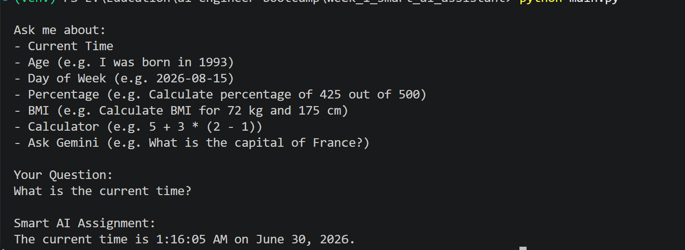
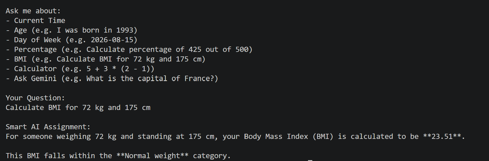
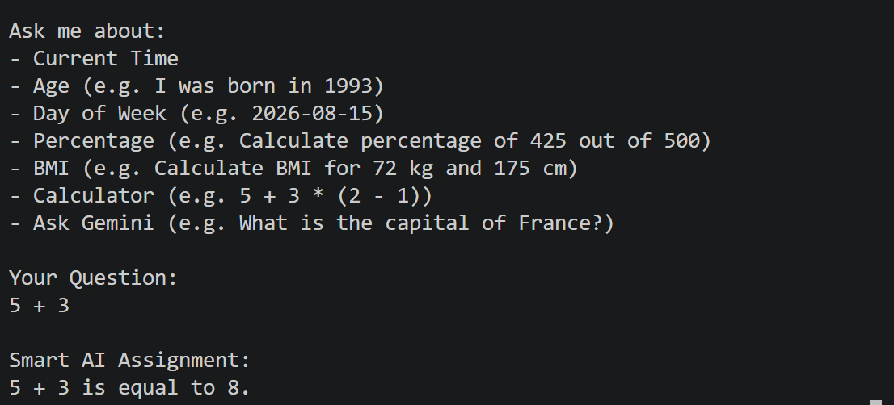
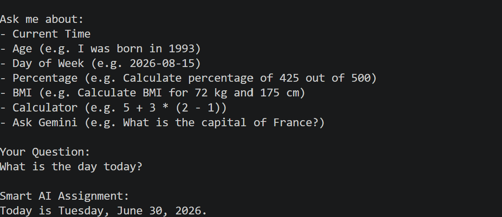

# 🤖 Smart AI Assistant


A modular AI-powered assistant built using **Python** and the **Google Gemini API**.

This project demonstrates the core concepts of **AI Agent Engineering**, including prompt engineering, structured outputs, prompt chaining, tool execution, and modular software architecture.

It was developed as the **Week 1 Mini Project** of my AI Agent Engineering Bootcamp.

---

# 📖 Table of Contents

* Overview
* Features
* Technologies Used
* Project Structure
* System Architecture
* Available Tools
* Installation
* Environment Variables
* Running the Project
* Example Questions
* Screenshots
* AI Engineering Concepts Demonstrated
* Future Roadmap
* Learning Outcomes
* Requirements
* Author
* License

---

# 🚀 Overview

The Smart AI Assistant accepts natural language questions, determines whether a Python tool is required, executes the appropriate tool when necessary, and generates a friendly natural language response.

Examples include:

* Current Time
* Age Calculation
* Percentage Calculation
* Day of the Week
* BMI Calculation
* Mathematical Calculations
* General Knowledge Questions

---

# ✨ Features

✅ Current Time Tool

✅ Age Calculator

✅ Percentage Calculator

✅ Day of Week Calculator

✅ BMI Calculator

✅ Calculator Tool

✅ General Knowledge using Gemini

✅ Prompt Templates

✅ Prompt Chaining

✅ Structured JSON Output

✅ Manual Function Calling

✅ Error Handling

✅ Modular Project Architecture

---

# 🛠 Technologies Used

* Python 3.12+
* Google Gemini API
* google-genai SDK
* python-dotenv
* JSON
* Regular Expressions
* datetime
* VS Code

---

# 📁 Project Structure

```
smart-ai-assistant/

│── config.py
│── main.py
│── prompts.py
│── tools.py
│── .env
│── requirements.txt
│── README.md
```

### config.py

Contains:

* Gemini Client
* Model Name
* Environment Variables

---

### prompts.py

Contains:

* Tool Descriptions
* Tool Selection Prompt
* Final Response Prompt

---

### tools.py

Contains all Python business logic:

* Current Time
* Age
* Percentage
* Day of Week
* BMI
* Calculator

---

### main.py

Controls the AI workflow:

1. Receive User Input

2. Build Prompt

3. Gemini selects tool

4. Execute Python tool

5. Send tool result back to Gemini

6. Generate final natural response

---

# 🏗 System Architecture

```
                   User
                     │
                     ▼
          Tool Selection Prompt
                     │
                     ▼
              Google Gemini
                     │
          Structured JSON Output
                     │
                     ▼
           Execute Python Tool
                     │
                     ▼
           Final Response Prompt
                     │
                     ▼
              Google Gemini
                     │
                     ▼
              Final Response
```

---

# 🔧 Available Tools

## ⏰ Current Time

Example

```
What time is it?
```

---

## 🎂 Age Calculator

Example

```
I was born in 1998
```

---

## 📊 Percentage Calculator

Example

```
Calculate percentage of 425 out of 500
```

---

## 📅 Day of Week

Example

```
2026-08-15
```

---

## ⚖️ BMI Calculator

Example

```
Calculate BMI for 72 kg and 175 cm
```

Output

```
BMI: 23.51

Category:
Normal Weight
```

---

## 🧮 Calculator

Supports:

* Addition
* Subtraction
* Multiplication
* Division
* Parentheses

Examples

```
25 + 30

100 / 5

10 * (5 + 3)

25 - 12
```

---

## 💬 General Knowledge

Example

```
Who invented React?

What is Machine Learning?

Explain OOP.
```

---

# ⚙ Installation

## Clone Repository

```bash
git clone https://github.com/YOUR_GITHUB_USERNAME/smart-ai-assistant.git
```

Move into the project

```bash
cd smart-ai-assistant
```

---

## Create Virtual Environment

Windows

```bash
python -m venv venv
```

Activate

```bash
venv\Scripts\activate
```

Mac/Linux

```bash
source venv/bin/activate
```

---

## Install Dependencies

```bash
pip install -r requirements.txt
```

---

# 🔑 Environment Variables

Create a `.env` file.

```
GEMINI_API_KEY=YOUR_API_KEY
```

---

# ▶ Running the Project

```
python main.py
```

---

# 💬 Example Questions

```
What time is it?

I was born in 1993

Calculate percentage of 425 out of 500

Calculate BMI for 72 kg and 175 cm

What day was 2026-08-15?

25 + 35

Who invented React?

Explain Artificial Intelligence.
```

---

# 📸 Screenshots

Add screenshots here after running the application.

Suggested screenshots:

```
📷 Home Screen


📷 Age Calculator


📷 Percentage Calculator


📷 BMI Calculator


📷 Calculator Tool


📷 Day of the Week

```

---

# 🎯 AI Engineering Concepts Demonstrated

This project demonstrates:

* Prompt Engineering
* Prompt Templates
* Prompt Chaining
* Structured JSON Output
* Manual Function Calling
* Tool Selection
* Tool Execution
* AI Agent Workflow
* Modular Software Design
* Error Handling
* Gemini API Integration

---

# 📈 Future Roadmap

Upcoming improvements include:

* Native Gemini Function Calling
* Native Structured Outputs
* Tool Registry
* Conversation Memory
* Multi-Step Tool Calling
* Vector Database Integration
* Retrieval-Augmented Generation (RAG)
* Multi-Agent System
* Streamlit Web UI
* Docker Support
* Cloud Deployment
* CI/CD Pipeline

---

# 🎓 Learning Outcomes

Through this project I learned:

* How Large Language Models interact with Python applications
* Prompt Engineering best practices
* Prompt Chaining
* Building AI tools
* AI Agent architecture
* Modular Python development
* Error handling
* JSON parsing
* API integration

---

# 📦 Requirements

```
google-genai
python-dotenv
```

Generate automatically using:

```bash
pip freeze > requirements.txt
```

---

# 👨‍💻 Author

**Kunal Sharma**

Senior Software Engineer

Aspiring AI Agent Engineer

Frontend Engineer (React.js)

Passionate about Generative AI, AI Agents, RAG, and LLM-powered applications.

---

# ⭐ Next Milestones

* Week 2 — Native Function Calling
* Week 3 — RAG
* Week 4 — Multi-Agent Systems
* Week 5 — Web Interface
* Week 6 — Production Deployment

---

# 🤝 Contributions

Contributions, suggestions, and feedback are welcome.

Feel free to fork the repository and submit a pull request.

---

# 📄 License

This project is licensed under the MIT License.

You are free to use, modify, and distribute this project for educational purposes.

---

⭐ If you found this project useful, consider giving it a star on GitHub!
